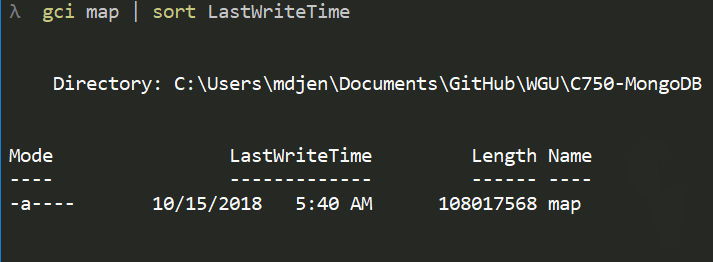

# OpenStreetMap Data Case Study - Salt Lake City, Utah

## Overview

In this case study, I have used Python and MongoDB to investigate the structure of XML Data from the Open Street Map Project (OSM). After investigation of XML metadata, further investigation was done into the uniformity of the data.

### Area Of Investigation

The area chosen for investigation is my home city of Salt Lake City, Utah. This area was chosen as I have some familiarity with the area's addressing and landmarks.  

Salt Lake City addresses its streets using a direction based grid system. At the center of the grid, is the LDS Temple. The address provides a distance as a number of city blocks times 100 and a direction of travel away from the temple. For example, 350 East would be three and a half city blocks East of the LDS Temple. The address portions describing the direction of travel away from the LDS Temple will be referred to as "directionals".

The map data was obtained from [https://www.openstreetmap.org/](https://www.openstreetmap.org/). From this site, I performed a search for "Salt Lake City". The first item in the search results was selected as the area of interest. From here, I went to the data's export page. A direct link to this export page has been provided below. Due to the size of the data set, I found it best to utilize the prepared Overpass API source.

Salt Lake City, Utah, United States  
[https://www.openstreetmap.org/export#map=12/40.7765/-111.9206](https://www.openstreetmap.org/export#map=12/40.7765/-111.9206)

Overpass API data source  
[https://overpass-api.de/api/map?bbox=-112.1155,40.6387,-111.7255,40.9140](https://overpass-api.de/api/map?bbox=-112.1155,40.6387,-111.7255,40.9140)

This provided a map dataset approximately 105mb in size.  

### Included Scripts

The follow list of scripts were used to perform the data investigation. A brief description of each script has been provided. These scripts were written and tested with Python 3.7.

* [element_getter.py](.\element_getter.py): provides a method of element iteration that serves full elements.
* [describe_xml.py](.\describe_xml.py): generates meta-data about an XML data structure.
* [desc_tag_attribs.py](.\desc_tag_attribs.py): restructures tag data to facilitate investigation of data uniformity.
* [xml_desc_to_mongo.py](.\xml_desc_to_mongo.py): loads the meta-data from describe_xml.py to MongoDB for investigation
* [tag_attr_desc_to_mongo.py](.\tag_attr_desc_to_mongo.py): loads the structured tag data from desc_tag_attribs.py to Mongodb for investigation
* [map_to_mongo.py](.\map_to_mongo.py): loads unaltered OSM data to mongodb.
* [slc_street_cleanup.py](.\slc_street_cleanup.py): produces uniform street and house number addressing and loads it to mongodb.

### Questions Asked / Problem Areas

In the exploration of the data set, the following questions were asked and problem areas addressed.  

* What elements exist within that file?
* What attributes do those elements have?
* What data types are found for those attributes?
* Which elements are nested?
* What tag values exist?
* Which tags values are used the most?
* Who is providing this data?
* What is 'tiger:' data?
* How common is it for address data to be entered with abbreviated directionals?
* Which casing of address directionals is most used?
* Which addresses are valid but look like abbreviated directionals?
* Finally, make street address directionals uniform.

## Investigation

### Parsing and Collecting XML Metadata

To begin my investigation, I took the stance of someone that has no foreknowledge of OSM data. This approach allowed me to view the data in a method of discovery that can be applied to completely foreign data sets. The first step in this discovery process was to obtain information about the XML schema used to structure the data.

XML at its most basic is a structured collection of elements. Therefore, we can structure a description of XML as a list of element descriptions.  

Elements can be described by their name, attributes, text and what elements are nested in them. Element names are unique for each element type. Although elements of the same name do not necessarily need to have the same attributes, nested elements or text. For the other element aspects, we're not interested in actual values yet. We are interested in the data types stored in those aspects.  

This leads to the following data structures for storing XML Metadata.

#### XML Description structure

    {
        elements:[  
            {elem1},  
            ...,  
            {elemN}  
        ]
    }

#### Element Description Structure

    {  
        name: string  
        attribs: {attrib_name:[types...], ...},  
        nested_elements: [types...],  
        text: [types...]  
    }

To generate this JSON formated metadata from an XML document, I wrote the describe_xml.py script. One of the benefits of having metadata in JSON format is the ease of loading it to a MongoDB engine. To facilitate loading XML descriptions to a local MongoDB instance, the xml_desc_to_mongo.py script has been provided.

The xml_desc_to_mongo.py script contains a method named load_xml_desc_to_mongo. This method takes three arguments, the name of the file to parse, the collection to store it in, and optionally the database for that collection. If no database is defined, the description will be loaded to a collection in the xml_description database. For my purposes of investigating OSM map data, I will be loading this data to a collection named osm_map. This structuring of our database allows for creating a database containing collections of xml metadata.

### Investigating OSM XML Metadata

## Additional Ideas

* Valid name abbreviations could be mistaken as abbreviations for street directions by our regex. Additional logic may be necessary to prevent this in other use cases. An investigation of our current data set shows this logic is unnecessary for now.
* The current attitude towards tiger data speaks nothing about its state in the dataset. Is there any value in determining the current state of that data and cleaning as necessary?

## Conclusion

Python and MongoDB are powerful tools for data manipulation.