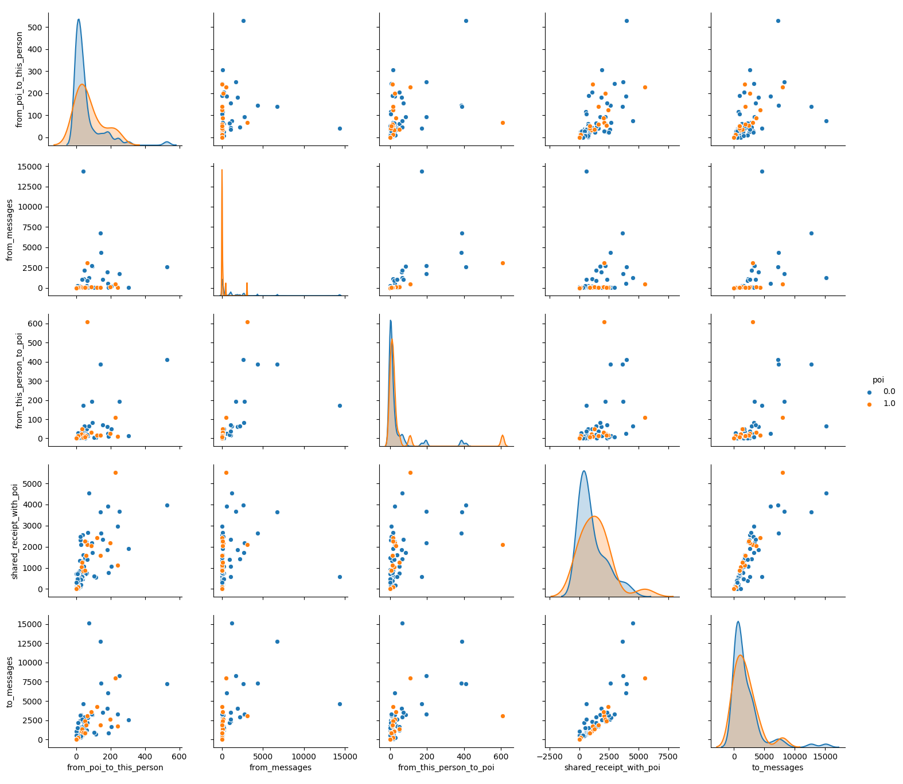
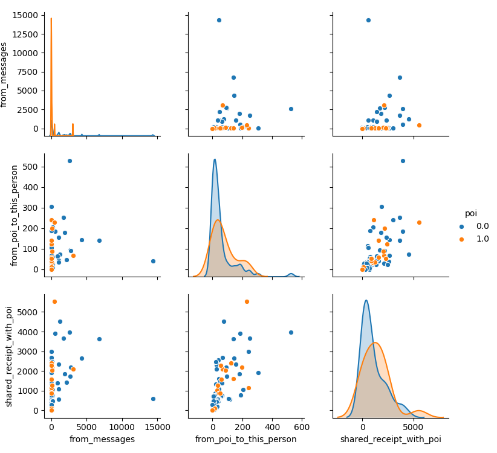
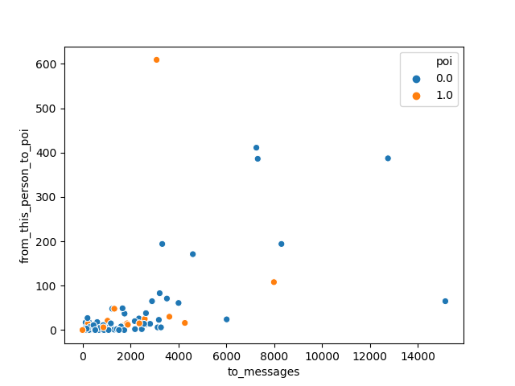
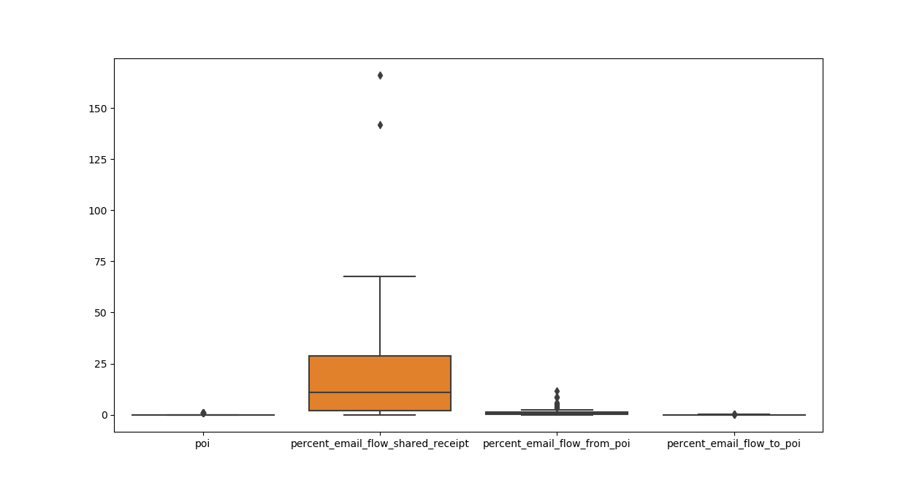
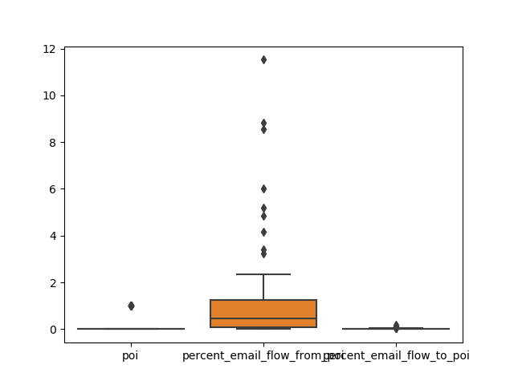

# Questions and Answers

## Summarize for us the goal of this project and how machine learning is useful in trying to accomplish it. As part of your answer, give some background on the dataset and how it can be used to answer the project question. Were there any outliers in the data when you got it, and how did you handle those?  [relevant rubric items: “data exploration”, “outlier investigation”]

The stated goal of this project is to create a person of interest classifier with a dataset scraped together from the Enron scandal. The actual goal of the project is to demonstrate an ability to apply statistical learning techniques to a toy dataset. The dataset has 3 primary sources of information. A manually scraped news article provides labels for our people of interest. A financial reporting spreadsheet provided the most populated data. Third, a partially parsed email dump.  

This mismatch of data sources resulted in an oddly shaped dataset. After removing the 5 problem entries, 141 entries remained. The removed entries are: "Total" and "The Travel Agency in the Park" for not being people; "Robert Belfer" and "Sanjay Bhatnagar" for values that are not sane; and "Eugene Lockhart" for no values.

To assist in data exploration, I added two booleans to each entry. One to state if email data existed for the entry and another if financial data existed. These booleans were used to identify the intersection of the email and financial data sources.

### Email Data Population

Number of people with an email address: 110  
Number of people with email stats: 85  
Number of people with financial data: 141  
Number of people with both data types: 85  
Number of poi with both email stats: 14  

All of the remaining entries have some type of financial data.  
Twenty-five entries have an email address and no email statistics.  
Just under two-thirds of our entries have email statistics. Of those that do have email statistics, all email statistics are populated.  
With 18 persons of interest identified in our dataset, it's worth noting that 4 do not have any email statistics.

### Financial Data Population

On the financial data side, all observations have some amount of the 14 financial features populated. However, the financial data is more sparsely populated than the email statistics. The loan_advances field is especially of note. There's only 3 entries with something for loan_advances.  

#### Financial Feature Percent Populated

loan_advances               0.02
director_fees               0.11
restricted_stock_deferred   0.12
deferral_payments           0.27
deferred_income             0.34
long_term_incentive         0.45
bonus                       0.57
other                       0.64
salary                      0.66
expenses                    0.66
exercised_stock_options     0.71
restricted_stock            0.76
total_payments              0.86
total_stock_value           0.87

## What features did you end up using in your POI identifier, and what selection process did you use to pick them? Did you have to do any scaling? Why or why not? As part of the assignment, you should attempt to engineer your own feature that does not come ready-made in the dataset -- explain what feature you tried to make, and the rationale behind it. (You do not necessarily have to use it in the final analysis, only engineer and test it.) In your feature selection step, if you used an algorithm like a decision tree, please also give the feature importances of the features that you use, and if you used an automated feature selection function like SelectKBest, please report the feature scores and reasons for your choice of parameter values.  [relevant rubric items: “create new features”, “intelligently select features”, “properly scale features”]

Feature selection started as a result of manual data investigation with extension into some statistical techniques. Based on my original dataset investigation, all email data was rejected as not all entries had email data. The remaining financial data was then further thinned by leveraging some unsupervised learning techniques to weight each feature. The most relevant features were selected from those results. The results of this feature selection have since been rejected.  

On this feature selection redo, a few features have been manually dropped. The only information gained from having email addresses is knowing who has emails but doesn't have email statistics. That raises more questions than it answers. The field will be dropped. The booleans added during investigation have been exhausted of their usefulness. Those too will be dropped. On the financial side, total_payments and total_stock_value are calculated fields. They corelate highly with other fields due to the redundancy they contain. No reason to weigh things twice. Finally, loan_advances will be dropped. With only three observations, two of which are persons of interest, the information this extremely sparse field could offer is warping or negligible. Based on earlier tests with boosted weak learners, it's mostly the later.  

To complete the feature selection process this go around, I took some advice and integrated SelectKBest into the pipelines I'll be feeding into GridSearchCV to select the algorithm. Included in the KNN and SVC classifier pipelines is a StandardScalar. Scaling values to comparable is necessary when looking for relationships between features. SVC (specifically Linear_SVC) and KNN both rely on normalized data when factoring the impact of the relationship between two features.  

## What algorithm did you end up using? What other one(s) did you try? How did model performance differ between algorithms?  [relevant rubric item: “pick an algorithm”]

When it came to algorithm selection, I decided to compare K-Nearest Neighbors and Support Vector Classifiers. Both of these are known for their ability to classify smaller datasets under supervised learning. Deciding between them came to which gave the best precision. Some consideration was given to linear regression for classification. Given the plotted structure of the data and poor initial testing, this model was dropped.  

Between K-Nearest Neighbors and Support Vector Classifiers, the stock SVC configuration had slightly better accuracy. Some tuning was done for both algorithms before I focused on tuning the SVC classifier. That was all before I revisited how I was handling feature selection.  

After reintroducing the email data, precision of both SVC and KNN classifiers greatly improved. The KNN classifier improved so well that it is now performing better than SVC. The best precision for KNN reached 40% where as SVC only reached 35%. This was a short lived gain as I tuned algorithm parameters further.  

## What does it mean to tune the parameters of an algorithm, and what can happen if you don’t do this well?  How did you tune the parameters of your particular algorithm? What parameters did you tune? (Some algorithms do not have parameters that you need to tune -- if this is the case for the one you picked, identify and briefly explain how you would have done it for the model that was not your final choice or a different model that does utilize parameter tuning, e.g. a decision tree classifier).  [relevant rubric items: “discuss parameter tuning”, “tune the algorithm”]

Algorithm parameter tuning is a method of adjusting algorithm performance by manipulating constants within the algorithm. Performance adjustments can be made for algorithm speed or accuracy. In this case, performance in classifier precision was the target of the adjustments. Improper algorithm tuning can result in poor algorithm performance.  

I took a brute force approach to classifier tuning. GridsearchCV allowed me to setup multiple parameter sets for an algorithm. It then runs through the parameter sets and returns the best parameter set based on the specified metric. This allowed me to try many different parameters for the SVC algorithm. In the initial pass, where I compared SVC to K-NN, I limited my parameter tuning to kernel type and penalty parameter for SVC and number of neighbors and weight functions for K-NN.  

One adjustment I made was to the maximum number of features SelectKBest was allowed to use. Initially, I at most allowed only half of the features to be used. By doubling the number of allowed features in the final classifier resulted in an support vector classifier with a 45% precision score. Previously, it produced 35% precision at best. This gain in precision came at the cost of performance. Runtime had a noticeable increase in seconds if not minutes. As runtime is not of concern for this project, I accept this extra time. It is worth noting, that this new best classifier only used nine features. One more than the previous maximum. If runtime does become a concern, this would be the first parameter I'd adjust.  

There was still one issue. All this focus on precision left a lot of room for improvement with the classifier's recall. To rebalance recall with precision, I changed my scorer to F1. The F1 score provides a weighted average between precision and recall. This additional parameter adjustment ended up sacrificing my latest gains in precision for a near tripling of recall. It also resulted in a switch back from SVC to KNN being better and a drop in only 3 features used in the resulting classifier.  

## What is validation, and what’s a classic mistake you can make if you do it wrong? How did you validate your analysis?  [relevant rubric items: “discuss validation”, “validation strategy”]

Validation is the process of ensuring any decision made doesn't improperly impact the algorithm. For instance, different training and testing splits in the dataset can have wildly different results in algorithm training. Another common issue for validation is balancing the bias, variance dilemma. Validation helps to ensure balance between overfitting and under fitting the data.  

My validation strategy included cross validation through 10-fold data partitioning. This provided a wide sampling of data splits to avoid overfit and underfit scenarios.  

## Give at least 2 evaluation metrics and your average performance for each of them.  Explain an interpretation of your metrics that says something human-understandable about your algorithm’s performance. [relevant rubric item: “usage of evaluation metrics”]

There were two evaluation metrics that I gave the most consideration. Accuracy was the first. Accuracy was problematic for the dataset in use because of the sparse nature of the persons of interest. Accuracy only states how many people were classified correctly. Classifying no one as a person of interest results in a 86% accuracy score.  

The poor measure offered by accuracy pointed me to precision as the metric to judge the classifier. Precision tells how accurate the classification is. A classifier might claim a group of 10 birds are all ducks. In actuality, that group of 10 bird might have 7 geese and only 3 ducks. This would mean a precision of 30%. There may be more birds than the 10 originally accused of being ducks. Precision only cares about the ones that were classified as ducks. Accuracy takes into account all the other birds not labeled as ducks.

Our interest is in who is classified as a poi. Are those classified as poi actually a person of interest? Were all poi classified as poi? Precision tells us how many of those classified as poi are a hit. Recall tells us how many of all possible hits were made. Put to an extreme; if I say everyone is a poi then every actual poi has been labelled as such and my recall is perfect. That leaves a lot to be desired with my precision as I would have many innocents labelled as poi.  

## Feature Engineering

Before getting too deep into strangling more value from our dataset, let's note the state of the classifier.  

```{python}
Pipeline(memory=None,
         steps=[('selectkbest',
                 SelectKBest(k=3,
                             score_func=<function f_classif at 0x000001D3F5125378>)),
                ('standardscaler',
                 StandardScaler(copy=True, with_mean=True, with_std=True)),
                ('kneighborsclassifier',
                 KNeighborsClassifier(algorithm='auto', leaf_size=30,
                                      metric='minkowski', metric_params=None,
                                      n_jobs=None, n_neighbors=1, p=2,
                                      weights='uniform'))],
         verbose=False)
        Accuracy: 0.81267       Precision: 0.32437      Recall: 0.37400 F1: 0.34742     F2: 0.36290
        Total predictions: 15000        True positives:  748    False positives: 1558   False negatives: 1252   True negatives: 11442
```

The classifier currently meets requirements. Can we get it to do better? Could we wring more information from our dataset by transforming some features into new features? A good place to look for a new feature would be the email data. Financial data should be full of information as is. Money typically is the goal of fraud. Email is where we'll start our search for a more informational feature.  

  

Some of these features make no sense. Emails received and emails sent say nothing about participation in fraud. Emails that involve a person of interest do say something about possible participation in fraud. Also, some of these graphs offer a nonsensical relationship. A count of emails sent to a person of interest has no sensible relationship to emails where you shared receipt with a poi.  

  

  

This gives a much better view of the flow of emails for each person's mailbox. The problem is we're seeing the flow of emails involving poi in terms of the volume of emails. Volume of email isn't information we want. It says nothing about relationship with the persons of interest. The percent of a person's email flow that involved a person of interest, that would give information pertinent to our use case.  

  

Seems there's a problem with one of our new features. The flow of emails for one of these features should not exceed 100 percent. It seems whomever calculated the "shared receipt" email feature has a bug in their calculations. Fixing other people's bugs is out of scope for this project. This feature will be removed for now.  

```{Python}
SVC Best Score: 0.41465721040189124
KNN Best Score: 0.3470449172576832
Pipeline(memory=None,
         steps=[('selectkbest',
                 SelectKBest(k=15,
                             score_func=<function f_classif at 0x00000272E55F5378>)),
                ('standardscaler',
                 StandardScaler(copy=True, with_mean=True, with_std=True)),
                ('svc',
                 SVC(C=7, cache_size=200, class_weight=None, coef0=0.0,
                     decision_function_shape='ovr', degree=3, gamma='scale',
                     kernel='sigmoid', max_iter=-1, probability=False,
                     random_state=None, shrinking=True, tol=0.001,
                     verbose=False))],
         verbose=False)
        Accuracy: 0.84313       Precision: 0.38679      Recall: 0.30150 F1: 0.33886     F2: 0.31541
        Total predictions: 15000        True positives:  603    False positives:  956   False negatives: 1397   True negatives: 12044
```

Removing the broken feature sure changed our classifier. We're back to using SVC, and all features are being used.  

  

Whatever bug exists in the email poi data, it appears to have also crept into the emails from persons of interest. All incoming mail statistics do not appear sane. We'll drop them for now.  

```{Python}
There are 26 people with more mail from poi than mail in their inbox
There are 70 people with more mail shared with poi than mail in their inbox
There are 0 people that sent more mail to poi than mail in their outbox
```

```{Python}
SVC Best Score: 0.39361702127659576
KNN Best Score: 0.37588652482269497
Best Classifier
Pipeline(memory=None,
         steps=[('selectkbest',
                 SelectKBest(k=13,
                             score_func=<function f_classif at 0x00000291BF9279D8>)),
                ('standardscaler',
                 StandardScaler(copy=True, with_mean=True, with_std=True)),
                ('svc',
                 SVC(C=5, cache_size=200, class_weight=None, coef0=0.0,
                     decision_function_shape='ovr', degree=3, gamma='scale',
                     kernel='sigmoid', max_iter=-1, probability=False,
                     random_state=None, shrinking=True, tol=0.001,
                     verbose=False))],
         verbose=False)
        Accuracy: 0.84500       Precision: 0.39469      Recall: 0.30450 F1: 0.34378     F2: 0.31908
        Total predictions: 15000        True positives:  609    False positives:  934   False negatives: 1391   True negatives: 12066
```

Without the incoming mail statistics, we're still fairly close in performance to where we were before.


Swapping around the logic on "in_messages" and "out_messages" compared to the "from_poi", "shared_poi", "to_poi" in makes the email features seem cleaner. Is it possible the entire email parser is broken? What confidence can we have in the email features?  

```{Python}
HUMPHREY GENE recieved 17 messages from poi but only had 128 messages in their outbox.
HUMPHREY GENE recieved 17 messages from poi and had 17 messages in their inbox.
GLISAN BEN was on 874 messages with poi but only had 16 messages in their inbox.
GLISAN BEN was on 874 messages with poi and had 873 messages in their outbox.
There are 0 people with more mail from poi than mail in their inbox
There are 1 people with more mail shared with poi than mail in their inbox
There are 1 people that sent more mail to poi than mail in their outbox
```

```{Python}
SVC Best Score: 0.31465721040189126
KNN Best Score: 0.3470449172576832
Best Classifier
Pipeline(memory=None,
         steps=[('selectkbest',
                 SelectKBest(k=3,
                             score_func=<function f_classif at 0x000001ACB79979D8>)),
                ('standardscaler',
                 StandardScaler(copy=True, with_mean=True, with_std=True)),
                ('kneighborsclassifier',
                 KNeighborsClassifier(algorithm='auto', leaf_size=30,
                                      metric='minkowski', metric_params=None,
                                      n_jobs=None, n_neighbors=1, p=2,
                                      weights='uniform'))],
         verbose=False)
        Accuracy: 0.81280       Precision: 0.32480      Recall: 0.37450 F1: 0.34789     F2: 0.36338
        Total predictions: 15000        True positives:  749    False positives: 1557   False negatives: 1251   True negatives: 11443
```

Completely dropping the email data puts us back on a KNN classifier with only 3 features and now our Recall is better than our Precision. Considering the acceptable performance of the classifier without the problematic email data and considering the engineered feature is based on this questionable data.  
