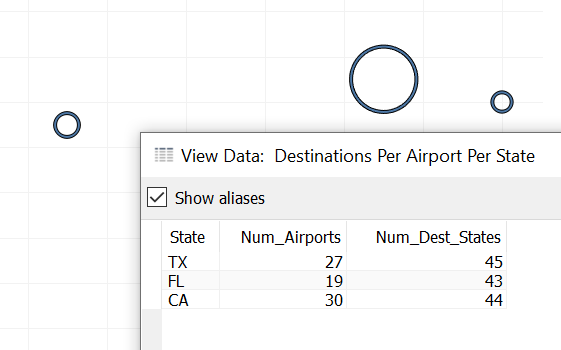

# How to Air Traffic

When I first picked out the flight data set I had ideas of investigating scheduling accuracy. As I started digging into the loading and processing of the raw data, I began to realize how much I really don't care about the end result of scheduling. What carriers or what airports have the most accurate schedules seems a very obvious inquiry. How can rehashing what others have already rehashed offer new and interesting insights?  

It didn't help that I kept encountering varied idiosyncrasies when pre-processing the data. They appeared to be the result of inconsistencies in how the data was either recorded or collected. This just eroded my confidence in getting any new insight from a detailed study of schedule accuracy. Perhaps there was a less apparent aspect of air travel I could investigate from this data.  

If there's one way to define travel, it could be called a change in relative space over time. In the case of air travel, measurements of space could be more forgiving than measurements of time. Counting miles lends greater leniency than grabbing at minutes. More plainly, we might find new insight by instead taking a look at where flights occur, how frequently they occur and on what vectors they occur.  

By measuring their actual throughput, we should be able to get an idea of each airport's capacity. With an understanding of capacity, we can explore potential improvements to the business of air travel other than time keeping. Congestion, for example, is one aspect that can indirectly impact scheduling and directly affect the traveler's experience. There's also a consideration that as actual throughput approaches capacity, the ability for the schedule to absorb an unscheduled event is lessened.  

## A Beginning

```{SQL}
SELECT
    `flight.route.origin_airport.iata`,
    `flight.route.destination_airport.iata`,
    `flight.route.origin_airport.state`,
    `flight.route.destination_airport.state`,
    `flight.route.origin_airport.city`,
    `flight.route.destination_airport.city`,
    `flight.route.direction`,
    `flight.route.distance_calculated`,
    `times.sched_depart_utc`,
    `times.sched_arrive_utc`
FROM detailed_flights
```

After preprocessing and loading I started with mapping the airport locations. Marking both the origin and destinations for each flight made no difference between marking one or the other. This makes sense as every airport has flights arriving and departing. Adding filters for origin and destination airports did offer a bit of insight. Just because there's an airport at your destination doesn't mean there's a direct flight to it from your local airport. 

  

The largest hurdle to investigating how you can get from point A to point B is the performance when querying the denormalized flight data. Each change in selection results in a new dataset that takes 5-10 minutes to compile as all 123 million records are required. As I'm most interested in route data at this point, the denormalized flight data can be set aside and the route data captured in preprocessing can be leveraged. With only 8607 unique routes, I expect it will offer quicker exploration.  

```{SQL}
SELECT
    `origin_airport.iata`,
    `origin_airport.country`,
    `origin_airport.state`,
    `origin_airport.city`,
    `destination_airport.iata`,
    `destination_airport.country`,
    `destination_airport.state`,
    `destination_airport.city`,
    direction,
    distance_calculated
FROM detailed_routes
```

From my initial poking of the denormalized flight route data, I found building a hierarchy of the airport location identifiers helpful. With the smaller dataset, including country became a reasonable add. The dataset, despite its size, is limited to US based airports. This was made most apparent after adding one end of the route location hierarchy.  

  

With smaller source data, I was able to experiment more with the display of origin vs destination data. The result that gave the most intuitive result had a filter on either origin or destination and a mark on the other end of the journey.

The speed in exploration gained by limiting accessed data isn't without cost. Without the time data, an exploration on how to visually represent the number of actual flights had to be shelved.  


In this visualization, the volume of departing flights at each airport is displayed via size. An additional dimension of information, direction of travel, was added as a color. 100% opacity and order of layering is hiding quite a bit of that information. If this wasn't questioned, one might think every flight not originating from the east coast is destined to the east coast.


Adjusting the opacity and layering order does give a clearer picture of how the various directions of travel are broken out for each airport. There is an issue of interpreting color as direction. Without the legend, it's not intuitive. With the reordering, there's too many colors to keep track of. It may be better to take a step back and look at air travel capacity from a more general perspective.  

## Airport Diversity

One way to readjust our view into this data is to see how many destinations are available from each airport. Each route entry is unique. Therefore, a simple count will tell us how many 
destinations are available from each origin.  


By state, there's four states with what could be describes as exceptional route diversity. California has the most available destinations at 817. The next most diverse is Florida at 648 and Texas with 636. The sudden drop for New York's 447 is followed by another drop with Virginia at 322. 

Referring back to the flight density map; California, Florida, and Texas all seem to have a good share of airports, each with a notable amount of traffic. Compared to Georgia or Illinois, which appear to have the airports with the most traffic but all that traffic is centered on one airport. This is more apparent when we drill down to each individual airport.  

This relationship between the number of airports a state has and the air travel route diversity for that state is only logical. Routes are being defined by their origin. If a state has more possible points of origin, it stands to reason it has more potential routes. If I'm heading to Nevada and there's four airports in the state that fly there, then that state has four times the routes as another state that only has one airport. Confirmation of this can be attained by taking a count of airports by state.

  

Except for a few states that gained in rank, the result is almost perfectly matched in order. Alaska's break into the top 3 is worth noting. There's a large number of airports in Alaska and all of them have relatively few flights out.  

  

While Alaska isn't a large source of flights, that doesn't necessarily mean it's airports are less route diverse. We need a different metric for comparing air travel from point to point. The number of possible origins within a state compared to the number of possible destination states might give some inspiration.  

```{sql}
SELECT 
    COUNT(DISTINCT(`origin_airport.iata`)) as "Num_Airports",
    COUNT(DISTINCT(`destination_airport.state`)) as "Num_Dest_States",
    COUNT(DISTINCT(`destination_airport.state`)) as "Num_Dest_Airports",
    `origin_airport.state` as "State"
FROM detailed_routes
GROUP BY State
```

  

Not every spot is labeled and some appear to be doubled up. Changing our marks to use varied sizes, relative to the alphabetical order of the states helps to locate where data points are doubling.  

  

Not ideal, but it does give some separation of overlapped data.  
There are a few groups that I find intriguing.  


First, there's two groups of states a moderate number of airports.  
One group can reach most destination states, the other can only reach about half as many.

  
  

There's the two states that can reach the most number of states and the two that can reach the least number of states.  
Curiously, each set has the same number of airports.  

  
  

Finally, there's the four states with the most number of airports.  
The three of those that serve most states should not come as a surprise.
Alaska, however, does offer a bit of uniqueness. Alaska is the only state with more airports than destination states.

  
  

## Alaska

```{mongodb}
> db.detailed_flights.find({'flight.route.origin_airport.state':"AK"}).count()
842477
> db.detailed_flights.find({'flight.route.destination_airport.state':"AK"}).count()
841153
>
```

Alaska's uniqueness where it has more airports than destination states has me thinking it would be a great case study for our purpose. To be clear, our purpose in this project is to generate a story from a dataset. To this point, there has been an amount of data engineering to facilitate our investigation. Repackaging the whole set to be individually cloned is not feasible. Redeploying to a cloud based solution would be counter productive. The most reasonable solution would be a serialized extract that can be loaded to Tableau from flat files.  

The largest hurdle to generating a submittable dataset has been the limitations of Tableau. A quick query of the flight data shows the information regarding flights originating in Alaska is well below the 15 million record limit. If so inclined, flights arriving in Alaska could also be included for a possible extra dimension. The cost of adding flights into Alaska would be a doubling of the data extract. Even at double, the data extract would be just one tenth of the previously encountered limit.  

### Alaskan Extraction

```{sql}
SELECT
    `flight.carrier.code` as "carrier code",
    `flight.carrier.name` as "carrier name",
    `flight.flight_num` as "flight number",
    `flight.tail_num` as "tail number",
    `flight.route.route` as "route",
    `flight.route.bearing` as "bearing",
    `flight.route.direction` as "direction",
    `flight.route.distance_calculated` as "distance",
    `flight.route.destination_airport.iata` as "destination code",
    `flight.route.destination_airport.airport` as "destination name",
    `flight.route.destination_airport.country` as "destination country",
    `flight.route.destination_airport.state` as "destination state",
    `flight.route.destination_airport.city` as "destination city",
    `flight.route.destination_airport.lat` as "destination latitude",
    `flight.route.destination_airport.long` as "destination longitude",
    `flight.route.destination_airport.timezone` as "destination timezone",
    `flight.route.origin_airport.iata` as "origin airport code",
    `flight.route.origin_airport.airport` as "origin airport name",
    `flight.route.origin_airport.country` as "origin country",
    `flight.route.origin_airport.state` as "origin state",
    `flight.route.origin_airport.city` as "origin city",
    `flight.route.origin_airport.lat` as "origin latitude",
    `flight.route.origin_airport.long` as "origin longitude",
    `flight.route.origin_airport.timezone` as "origin tz",
    YEAR(`times.sched_depart_utc`) as year,
    MONTH(`times.sched_depart_utc`) as month,
    DAYNAME(`times.sched_depart_utc`) as weekday,
    `times.travel_times.recorded_scheduled` as "travel time"

FROM detailed_flights
WHERE
    `flight.route.destination_airport.state` LIKE "AK"
    OR
    `flight.route.origin_airport.state` LIKE "AK"
```

As the study is now centered around describing the history of flights in and out of Alaska, a number of fields are no longer necessary. With scheduling information, the planned year, month and weekday of a flight is sufficient. Details around the planned flight is more important than detail on how accurately a flight was executed according to its schedule.  

Using Tableau's built in export tool resulted in a csv with 1,120,208 lines and just over 270MB in size. Nothing to modern bandwidths, but something I'd want to reconsider if on a metered or dial-up connection. Reloading the extract to Tableau took almost no time at all.

### Alaskan Inquiry

Despite the reduction, there's still a wealth of questions we can ask of this dataset.  

* Are all airports or carriers in the dataset active for the entirety of the data's time frame?
* Are there periods when flights are less likely to occur? e.g. seasonal or weekend closures
* How many flights remain in the state and how many leave state?
* What is an average week of scheduled flight travel in Alaska like?

This only scratches the surface of possibilities. The important thing is to find and focus on one story. One place to start would be a measure of inbound, outbound and intrastate travel.  

For a comparison of of interstate and intrastate traffic, it would help to label each record. Rather than modifying our data extract, a simple if/else within Tableau should be sufficient to calculate this label.  

```{Tableau}
IF ([Origin State] == [Destination State]) THEN "Intrastate"
ELSEIF ([Origin State] == "AK") THEN "Outbound"
ELSEIF ([Destination State] == "AK") THEN "Inbound"
ELSE "Other"
END
```

  

The first numbers that jumps out are the numbers for Null-day. It's a stark reminder of an unaddressed challenge from preprocessing. Specifically, a regularly scheduled route missing date data. The missing date could be extrapolated within context of the regular schedule. To encourage forward momentum, metadata was added so these inconsistencies could be addressed as they're encountered.


```{mongodb}
> db.detailed_flights.find({'metadata.missing.sched_depart' : true, 'metadata.missing.sched_arrive':true, 'flight.route.destination_airport.state':"AK", 'flight.route.origin_airport.state': {$ne: "AK"} }).count()
147
> db.detailed_flights.find({'metadata.missing.sched_depart' : true, 'metadata.missing.sched_arrive':true, 'flight.route.origin_airport.state':"AK" }).count()
124
>

> db.detailed_flights.distinct("flight.carrier.code", {'metadata.missing.sched_depart' : true, 'metadata.missing.sched_arrive':true, 'flight.route.origin_airport.state':"AK" })
[ "UA" ]
>
> db.detailed_flights.find({'metadata.missing.sched_depart' : true, 'metadata.missing.sched_arrive':true, 'metadata.missing.actual_depart':true, 'flight.route.origin_airport.state':"AK" }).count()
0
> db.detailed_flights.find({'metadata.missing.sched_depart' : true, 'metadata.missing.sched_arrive':true, 'metadata.missing.actual_depart':true, 'flight.route.destination_airport.state':"AK" }).count()
0
>

> db.detailed_flights.findOne({'metadata.missing.sched_depart' : true, 'metadata.missing.sched_arrive':true, 'metadata.missing.actual_depart':false, 'flight.route.destination_airport.state':"AK" }, {'times':1, _id: 0})
"times" : {
                "sched_depart_utc" : null,
                "sched_arrive_utc" : null,
                "actual_depart_utc" : ISODate("1995-06-04T03:09:00Z"),
                "actual_arrive_utc" : ISODate("1995-06-04T06:15:00Z"),
                "travel_times" : {
                        "recorded_scheduled" : 206,
                        "recorded_actual" : 186,
                        "calculated_scheduled" : null,
                        "calculated_actual" : 186,
                        "taxi_in" : 4,
                        "taxi_out" : 12,
                        "air_time" : 170
                }
        }
}
>
```

United Airlines is the cause of all null scheduled date times in Alaska. Trusting the logic behind the metadata generation, actual departure date times should be available. As I recall, these null date times were the result of having dates and not times. The dates were captured with the existing arrival times. Seems a small modification to my Alaskan extract is in order.

```{SQL}
SELECT
    `flight.carrier.code` as "carrier code",
    `flight.carrier.name` as "carrier name",
    `flight.flight_num` as "flight number",
    `flight.tail_num` as "tail number",
    `flight.route.route` as "route",
    `flight.route.bearing` as "bearing",
    `flight.route.direction` as "direction",
    `flight.route.distance_calculated` as "distance",
    `flight.route.destination_airport.iata` as "destination code",
    `flight.route.destination_airport.airport` as "destination name",
    `flight.route.destination_airport.country` as "destination country",
    `flight.route.destination_airport.state` as "destination state",
    `flight.route.destination_airport.city` as "destination city",
    `flight.route.destination_airport.lat` as "destination latitude",
    `flight.route.destination_airport.long` as "destination longitude",
    `flight.route.destination_airport.timezone` as "destination Timezone",
    `flight.route.origin_airport.iata` as "origin airport code",
    `flight.route.origin_airport.airport` as "origin airport name",
    `flight.route.origin_airport.country` as "origin country",
    `flight.route.origin_airport.state` as "origin state",
    `flight.route.origin_airport.city` as "origin city",
    `flight.route.origin_airport.lat` as "origin latitude",
    `flight.route.origin_airport.long` as "origin longitude",
    `flight.route.origin_airport.timezone` as "origin tz",
    IFNULL(YEAR(`times.sched_depart_utc`), YEAR(`times.actual_depart_utc`)) as year,
    IFNULL(MONTH(`times.sched_depart_utc`), MONTH(`times.actual_depart_utc`)) as month,
    IFNULL(DAYNAME(`times.sched_depart_utc`), DAYNAME(`times.actual_depart_utc`)) as weekday,
    `times.travel_times.recorded_scheduled` as "travel time"
FROM detailed_flights
WHERE
    `flight.route.destination_airport.state` LIKE "AK"
    OR
    `flight.route.origin_airport.state` LIKE "AK"
```

  

And just like that the null days are gone.  

So Alaska's air travel is roughly evenly split between intrastate and interstate flights with the larger half remaining in state. Aside from a drop in intrastate travel on Sundays, there's not much difference between days. The number flights appear to remain consistent day after day.

But what about change in flight volume through out the year? In manipulating the format of my investigative graphs, I found the individual date part extracts rather limiting. I could investigate via year or month but seasons and quarters would require additional calculation. Travel trends through out the day are also locked to me.  

It seems the better practice would be to extract the full date and/or times and convert as needed. The question is on setup cost of times vs the pay off. For the current use case, flight times would allow mapping flight patterns throughout the day. The cost is spending the time to validate and correct the DST sanity of each time, determine which timestamp is relevant to Alaska and convert to local time. The obscene cost would also include wrangling an additional data source of historical sun up|down times.  

Having reformed the extraction query, it was time to update the travel type visualization to find a timeframe that provided a good view into the changing data.  


  

Showing the change in flight volume by year does show an increasing rate in flight travel. I removed the weekday break down. It didn't offer a visually different dimension. Addition of a quarterly dimension does give new insight. 2009 only exists in our Q1 dataset. Q1 and Q4 has much lower travel compared to the other quarters and travel tends to peak in Q3.  

  

Adding a split between interstate and intrastate travel gives an interesting comparison between the two types of travel. The boom in Alaskan flight travel that happened in the early 1990's is almost entirely driven by interstate travel. Intrastate travel does show growth with the travel boom of the 90's and remains mostly consistent for a decade before dropping off.  

It could be described as a rush to populate Alaska in the 90's. After population growth stabilized, the state relied on intrastate flights until infrastructure was built. Even though the intrastate flights dropped off, the airports remain busy through the spring and summer months with interstate travel. Given the remoteness of Alaska, this warm month interstate travel could be cargo or tourist based. There's not enough information to make such a determination.  

To wrap up this inter/intra state travel exploration, I took a look at how inbound, outbound and intrastate travel stacked up.  

  
  

What I find interesting is how the data seems to tell a different story depending on which type of travel is on top. There's an amount of lie to the top area. From the line graphs, it's easy to see interstate travel dominates the Spring and Summer and intrastate travel dominates the Fall and Winter. In the stacked area graph with intrastate travel on top, it almost seems as if intrastate travel dominates in the Summer. That could also be due to the break down of interstate travel into its directional components.  

  
  

Replacing the component interstate travel with total interstate travel does away with this illusion of dominating intrastate travel. Chalk this as a lesson in why you should compare like for like. To find a similar component analysis for intrastate travel would need another way of thinking about interstate travel.  

### Components of Intrastate Travel

Interstate travel too and from Alaska has been classified as inbound and outbound. In a more abstract sense, this is travel to and from a remote part of the greater whole. A like for like on intrastate travel would be flights from less remote to more remote airports. But how best define remote airports?  

My first idea is to ask; which airports have the most intrastate traffic? 

  

With just a simple glance, the winner is Ted Stevens Anchorage International (ANC). Almost every airport has a flight too and from this central hub. Before getting ahead of ourselves, what about Fairbanks International (FAI) and Juneau International (JNU)? While they may not have the variety of intrastate destinations as ANC, together they're involved with approximately 26% of intrastate travel.  

  
  
  

When looking at the two international airports individually. One in three intrastate flights from JNU go to ANC and four out of five intrastate flights from FAI go to ANC. It seems these three airports work together as the back bone for Alaskan air travel.  

### Bringing Back the Interstate

A picture of Alaskan intrastate traffic centered around one airport fed by two international airports has started to take shape. What about the interstate traffic?  

  
  

While the bar chart doesnt offer nearly the detail as text percents, it does make it easier to see just how prevailent traffic between two airports are. In this case, chances are you'll be going to Seattle-Tacoma Intl (SEA) if you're flying out of Alaska.
 
  

The same can be said flying into Alaska. Chances are you're catching a flight from Seattle.
